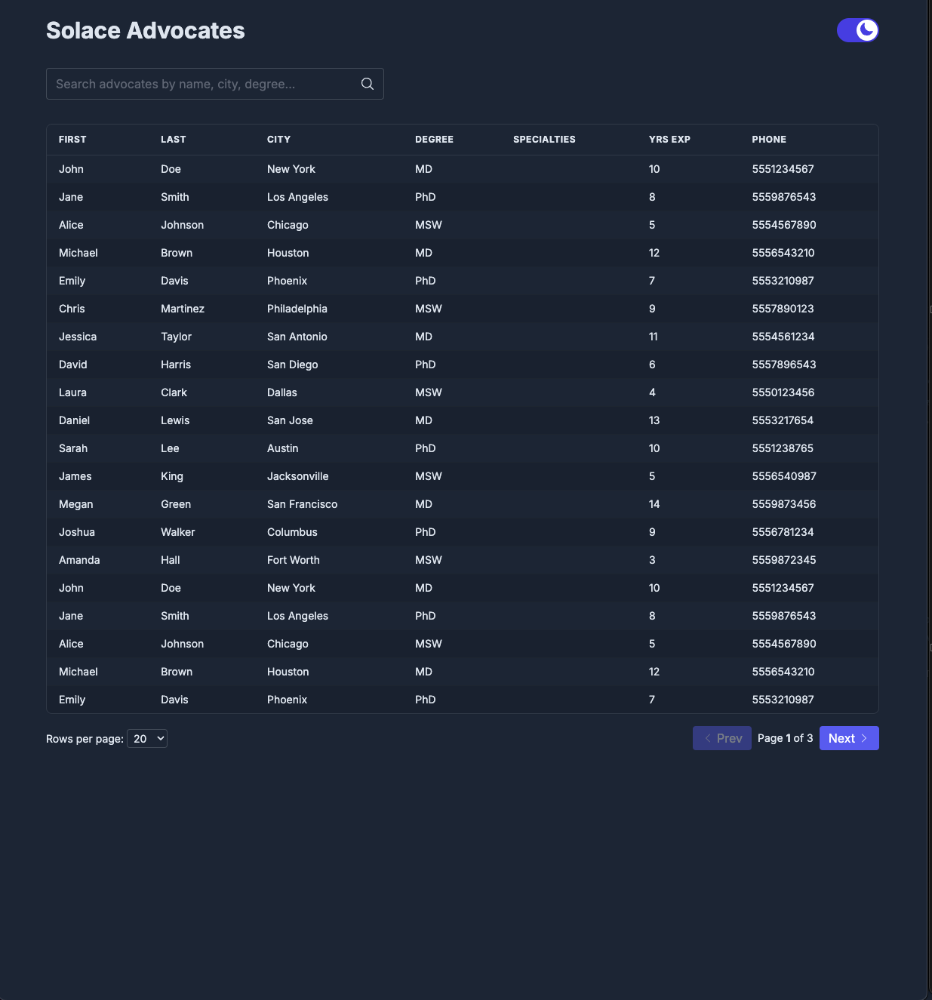
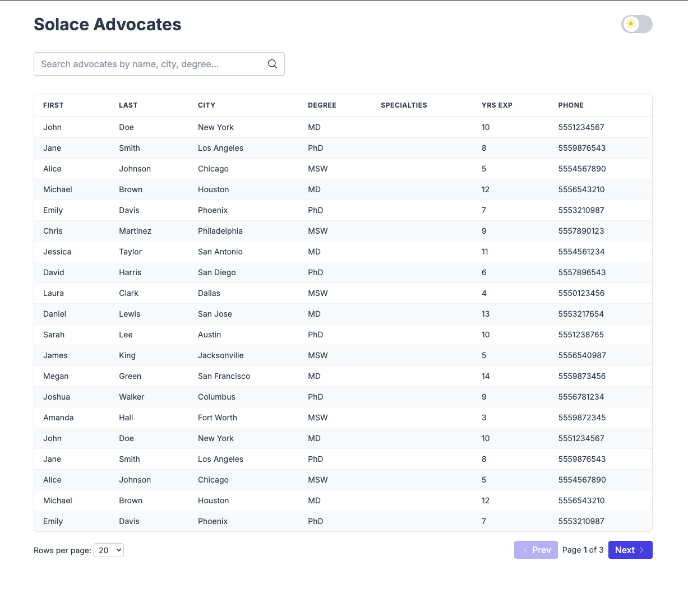

# Solace Discussion

This is my submission for the Solace take-home interview completed on 5/3/25.

## Table Of Contents

1. [Quick-start](#quick-start)
2. [Initial Impression](#initial-impression)
3. [Project Approach](#project-approach)
4. [Branching Strategy](#branching-strategy)
5. [Technical Design](#technical-design)
   - [Why PostgreSQL ?](#why-postgresql)
   - [Index strategy](#index-strategy)
6. [Frontend Implementation](#frontend-implementation)

## Quick-start

Follow these four one-liners to boot Postgres, migrate, seed, and run the dev server.

| Step                                 | Command          | What it does                                                    |
| ------------------------------------ | ---------------- | --------------------------------------------------------------- |
| 1️⃣ Start Postgres container          | `make up`        | Spins up the `db` service from **docker-compose.yml**.          |
| 2️⃣ Scaffold DB (+ create if missing) | `make db-create` | Ensures the `solaceassignment` database exists.                 |
| 3️⃣ Migrate & seed                    | `make db-setup`  | Runs Drizzle migrations (`push`) **and** seeds via `/api/seed`. |
| 4️⃣ Launch Next.js                    | `make dev`       | `npm run dev` with hot-reload.                                  |
| 5️⃣ Reset the db                      | `make db-reset`  | Resets the database back to initial state                       |

| Pro Tip: You can run `make db-setup` multiple times to generate more unique datasets to see how the indexes in this project are leveraged!

# Initial Impression

This was very familiar to me. I have worked with a very similar stack my whole career so I found my self enjoying the time spent learning about how easy it is for you to add routes/handlers with next.js. It came very quickly for me. I was able to leverage my React knowledge to build out a robust, interactable table that allows for both Dark/Light mode.

Overall, I spent about 3.5 hours on this. The timestamps in git may reflect more sporatic changes due to my availability today so while I technically went over the allotted time threshold I felt it necessary to mention it here. Not to sound cliche, but I genuinely _enjoyed this assignment_. Typescript, React, PostgreSQL are my bread and butter and I have heard about Next.js substantially so I was excited to get my hands dirty with it. I spent more time going through documentation and learning for _my behalf_ relative to overall time spent working on the assignment but I do feel it necessary to acknowledge the overtime spent here.

# Project Approach

I knew I wanted to segment this project into "epic branches". I did this to set an example of what has worked for me in the past. An _epic branch_ is an isolated, scoped branch that contains logically connected code [^more-info].

## Branching Stratedgy

0. [solace-candidate-assignment-main](https://github.com/Andrew-N-Solace/solace-candidate-assignment-main) (<small>This was the forked repo from the assignment given</small>)
1. [Epic Branch](https://github.com/Andrew-N-Solace/solace-candidate-assignment-main/pull/1) (<small>This was our main "epic" branch, all smaller feature branches were PR'd into this and would require their own dedicated approval by an engineer specializing in this domain.</small>)
2. [Solace Assignment: Infrastructure](https://github.com/Andrew-N-Solace/solace-candidate-assignment-main/pull/2) <small>This was the initial stub that contianed my makefile targets & helped me set the project up</small>
3. [Solace Assignment: Backend](https://github.com/Andrew-N-Solace/solace-candidate-assignment-main/pull/3) <small>This was the backend branch, containing the routing logic, middleware, etc.</small>
4. [Solace Assignment: Frontend](https://github.com/Andrew-N-Solace/solace-candidate-assignment-main/pull/4) <small>This was the frontend branch, containing all frontend routes since our backend was in a good spot.</small>

## Technical Design

### Why PostgreSQL?

- **I know it cold.** Years of tuning B-tree and trigram indexes let me keep queries < 20 ms without bolting on Elasticsearch.
- **Instant dev setup.** One `docker-compose up`, Drizzle migrates the schema—no extra licences or cloud add-ons.
- **SQL keeps things honest.** Real transactions, FKs, and `LIMIT / OFFSET` paging that drops straight into React-Query.
- **Room to grow.** Vector search? `pgvector`. Geo? PostGIS. Postgres scales features without forcing a future data-store migration.

---

### Index strategy

| Index                     | Speeds up                  | Notes                                                |
| ------------------------- | -------------------------- | ---------------------------------------------------- |
| `(first_name, last_name)` | name look-ups & alpha sort | Composite; left-most `first_name` still usable solo. |
| `(city)`                  | city filter                | Jump to city prefix instead of full scan.            |
| `(degree)`                | degree filter              | Small text domain; B-tree is enough.                 |
| `(years_of_experience)`   | `>= / ORDER BY` experience | Range + sort, index-only scan.                       |

_Chosen because UI searches use `prefix%` patterns—B-tree covers that fast; storage < 6 MB, negligible write cost._

---

### Frontend Implementation

React is arguably my strongest suite and I wanted to highlight my ability to think beyond the prompt and ensure I produced the best posible result. Here are some insights to a few of my decisions:

1. _Server-side pagination_ - Allows the backend to handle the repsonsibility of managing large entities
2. _React-Query_ - Leveraged the built in cache so repeat searches hit memory, not the API. This leads to fewer calls, snappier UI with zero extra plumbing.
3. Dark/Light mode - standard practice for modern web-UIs. I think this degree of consideration is imperitive when providing a "service" to the public.
4. WCAG-compliant, ensures interactivity without the use of a mouse to ensure a degree of compliance necessary for varying degrees of disabilities

---

[^more-info]: **Branching concepts**

- **Epic branches** – long-lived for large, cross-cutting features; may spawn
  smaller feature branches.
- **Feature branches** – short-lived for individual stories or bug fixes;
  merged back into `main` or an epic branch.
- **Rebasing** – replay feature-branch commits on top of the latest epic/main
  to keep history linear and conflict-free.
